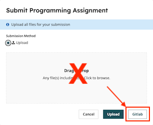

# Lecture 2, Exercise 4 - Git

## Prerequisite: Setting Up GitLab 
We will be using GitLab to submit exercises/homework and give feedback. GitLab is a web-based git hosting service that is similar to GitHub but hosted locally by the Computer Science Department.

These steps are error-prone and hard to get right the first time. Please ask for help if you get stuck!

### Generating an SSH key 
Before you can clone from GitLab, you will need to create an SSH key. SSH is a protocol supported by git to access GitLab securely and without password authentication.

You might be able to skip this entire section if you have already done this for another course. To check if you already have a key generated:

1. Open a terminal and run the following command: `ls ~/.ssh`
1. If you see a file called `id_ed25519.pub` or `id_rsa.pub`, that is your public SSH key. You can now proceed to the next section. Otherwise, continue on.

To generate a new SSH key:

1. Open your terminal and run the following command: `ssh-keygen -t ed25519`
1. Next, you will be prompted to input a file path to save your SSH key pair to. If you don’t already have an SSH key pair, use the suggested path by pressing `Enter`. Using the suggested path will normally allow your SSH client to automatically use the SSH key pair with no additional configuration.
1. Once the path is decided, you will be prompted to input a password to secure your new SSH key pair. It’s not required. If you don’t want to enter your password every time you use Git, you can skip creating it by pressing `Enter` twice.

### Adding SSH to your GitLab account
If you are using GitLab for the first time, you will need to submit your SSH key. To do this, follow these steps: 

1. Open a terminal and execute (replace with `id_rsa.pub` if needed): `cat ~/.ssh/id_ed25519.pub`
   This will print out the public key that you just generated.
1. Visit GitLab’s SSH key management page by going to [https://gitlab.cs.washington.edu/-/user_settings/ssh_keys](https://gitlab.cs.washington.edu/-/user_settings/ssh_keys). Click `Add new key` and paste your key into the box, and the rest of the fields should be filled in automatically. Press `Add key`.
1. In the terminal, run `ssh -T git@gitlab.cs.washington.edu` to ensure that your key is correctly set up. You should receive a welcome message and should not be prompted for a password.

## Step 1: Set up your shell for git
If you don't set your `$EDITOR` shell variable to nano, you may get stuck in a different text editor when you try to use git. Update the variable to nano:

```sh
$ EDITOR=/usr/bin/nano # or wherever your nano is on your system, use `which nano`
```

When you do this, the variable will only be updated for your **current terminal session**. If you'd like to make it permanent (and you should), then put the same command into your `~/.bashrc` file (or `~/.zshrc` file if you're using `zsh`).

## Step 2: Clone the repository
You should have gotten a link to an empty GitLab repository just before class. Clone the repository onto your computer with `git clone`. From the GitLab page for your repository, click on the black `Code` button to get the link to clone from. Make sure to use the "Clone with SSH" link.

## Step 3: Add your exercise3.sh file
Move your `exercise3.sh` file into the new repository. Add the file to git, then commit the addition.

## Step 4: Add the git workflow to the README
Edit the `README` file to answer the following questions.
1. Give the git commands that you can use to update and commit to the repository.
1. Explain what the `git status` command shows (in 1 sentence).
1. Explain what the `git diff` command shows (in 1 sentence).
Commit the change to the repository.

## Step 5: Push your repository
Push the changes to your repository to GitLab. You should have two new commits; verify this with `git log`.

## Step 6: Submit your repository to the exercise turn-in
Submit your Exercise 4 GitLab repository [via Gradescope to the Exercise 3&4 turn-in](https://www.gradescope.com/courses/1401685/assignments/8817508). When you open the submission pane, click on the "GitLab" link in the bottom right corner and do not upload directly, as shown here:


