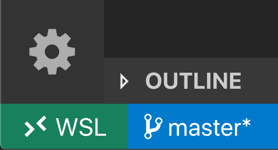

The course makes use of a number of software packages that students will install on their computers.
The following software are available for Windows, Mac, and Linux.

**Please try to install all of this software on your computer before the first day of class.**

## 0. Connect to the `eduroam` Wi-Fi network

For this class, you may have trouble using the `University of Washington` Wi-Fi network to do all activities. Instead, we *strongly* recommend that you be connected to `eduroam`. For instructions on how to connect to `eduroam`, follow the “How to access the eduroam network” section on [this page](https://uwconnect.uw.edu/it?id=kb_article_view&sysparm_article=KB0034255#howtouse).

## 1. Ensure you have access to a Unix-style terminal.

### MacOS and Linux operating systems

Use your operating system's program search (MacOS: spotlight search, Cmd-Space. Ubuntu: Ubuntu button in upper-left corner) up and search for `Terminal`.

You should get a window with a command prompt. Command prompt might have different words / characters, followed by a `$` and cursor for text input. Late 2018 and newer MacOS computers default to `zsh` instead of `bash`. This difference will briefly be covered in class, but you can run `bash` [+ Enter] in the terminal if you choose to use that instead.

### Windows 11 and Windows 10, version 1607+ (Windows Linux Subsystem)

All Windows users should note that the Windows command lines, cmd and PowerShell, differ greatly from the ``bash`` or ``zsh`` command prompt that programmers commonly use. From here on out, we will use "terminal" to refer to the Unix-style unless clearly and explicitly stated otherwise.

Before trying the suggestions below, try opening the Windows Store (from your start menu) and search for Ubuntu 26.04.  It will be a free download and installing it "will just work" for most recent versions of Windows 11 on relatively new hardware. 

If installing from the Windows Store does not work, we suggest following these instructions for [installing a WSL distribution](https://learn.microsoft.com/en-us/windows/wsl/install).

Some tips:
* We highly suggest using the Ubuntu 26.04 distribution (as of 2026). Ubuntu is one of the more beginner-friendly Linux distros. Any of the LTS ("Long-Term Support") versions should work, however - this includes 26.04, 24.04, and 22.04 (as of 2026).
* We suggest setting your Linux distribution username and password to match your Windows ones. This will reduce confusion!

## 2. Installing Python via Anaconda / Miniconda
We recommend that you use the most recent version of Python 3.  Slightly earlier versions of Python 3 work as well.  There are some differences between Python 2 and Python 3, and many systems only include Python 2.7 as a standard installation.  A Python installation for this course will be managed by the conda package management system, described below.

Conda is a system for installing and otherwise managing Python and other software packages. For data science purposes, conda is a great tool for administering complex, potentially multi-language projects, and we'll use conda in DATA 515 as well.

We recommend that you install conda from the open source community managed conda distribution because they offer terms of service that best align with academic research. The installers are available `here`[https://github.com/conda-forge/miniforge], scroll down to the Install heading and follow the directions for “Unix-like platforms” (Windows users will be installing this using their WSL bash terminal). Let it install in the default location and answer “yes” to the installer question about initializing conda.

**Windows users: please make sure to install conda on both your Windows computer AND your WSL instance, NOT just your Windows computer, so that you have access to it from within WSL. Follow the command-line instructions for a Linux instance.**

Below are detailed instructions **after** you have installed conda:
1. Update conda's listing of packages for your system: $``conda update conda``
2. Install Jupyter notebook and its requirements: $``conda install jupyter notebook``
3. Test that Jupyter notebooks run using the terminal to start the notebook: $``jupyter notebook``

If everything has worked correctly, it should print a URL to the console that opens an empty notebook. Depending on settings, it may automatically open the notebook server in your default browser.

## 3. Install a terminal text editor.
We highly suggest installing Nano, an easy to use text editor in the terminal. If you are familiar with another text editor, such as emacs or vi, then feel free to use that instead.

You might already have Nano installed. To check, enter $`nano -version` in the Terminal. If you get a version number back, for example `Nano 8.6`, then you have Nano installed. Nano is not installed if you get an error message saying: `command not found: nano`.

Note that some users have reported that on Windows using WSL they need to use $`nano --version` instead.

Note that on macOS, your Nano version will likely return a version of Pico, for example `Pico 5.06`. For the purposes of this course, Pico and Nano are identical terminal text editors.

### Installing Nano on a Linux operating system (including WSL)
For Ubuntu distributions, try `sudo apt-get install nano`. For others, $`yum install nano`.

### Installing Nano on the MacOS operating system
MacOS doesn't have a pre-installed package manager for their Unix programs. The best option is Homebrew with [full instructions on the website](https://brew.sh/). You can also choose to use [MacPorts](https://www.macports.org/install.php).

Once installed, download Nano with the following command in your terminal:
* `brew install nano` if using Homebrew
* `sudo port install nano` if using MacPorts

## 4. Install a graphical text editor.

Students can also select a graphical text editor of their choice, such as Visual Studio Code (all platforms), Atom (all platforms), Sublime (all platforms),Notebook (Windows), or vim (all platforms). A text editor is different from word processing programs, like MS Word, in that text editors often recognize program syntax and do no formatting. The instructor in this course will be using Visual Studio Code (also known as VS Code), so if you don't have a preference, then we recommend installing it.

[Visual Studio Code (also known as VS Code)](https://code.visualstudio.com/download) is a graphical code editor that can be customized and extended with a vast library of open-source extensions. After installing VS Code, install [the Python extension](https://marketplace.visualstudio.com/items?itemName=ms-python.python) and [the Jupyter extension](https://marketplace.visualstudio.com/items?itemName=ms-toolsai.jupyter).

If you frequently use R, you can install [the R language extension too](https://marketplace.visualstudio.com/items?itemName=REditorSupport.r).

### Visual Studio Code with Windows Subsystem for Linux

If you are using Windows and WSL, you MUST install the WSL extension for Visual Studio Code. Without this extension, you will not be able to run Visual Studio Code from WSL. Install the extension [here from the Extension Marketplace](https://marketplace.visualstudio.com/items?itemName=ms-vscode-remote.remote-wsl).

Whenever you run Visual Studio Code from WSL, you should see a small rectangle in the bottom left corner of your window that says WSL; if you don’t see this indicator, it likely means you’re not in WSL:

> Image credit: [https://code.visualstudio.com/docs/remote/wsl]([https://code.visualstudio.com/docs/remote/wsl)